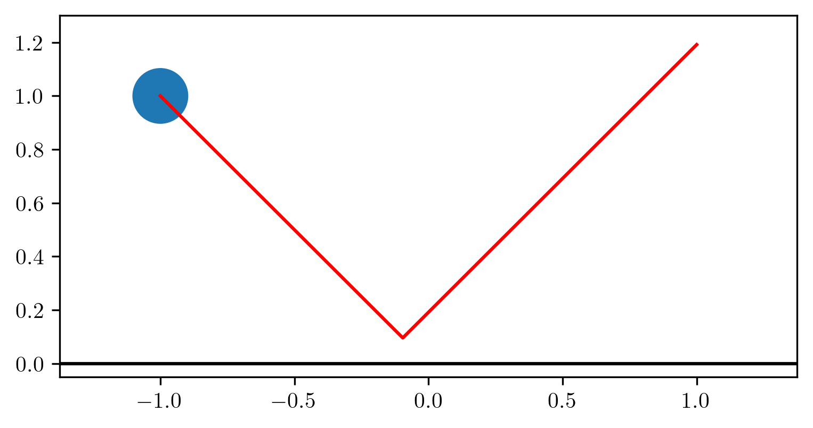
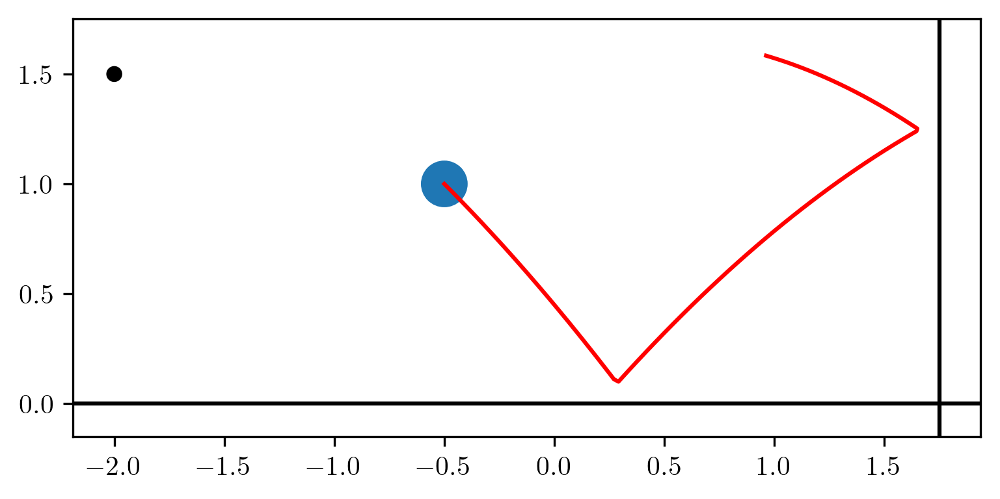
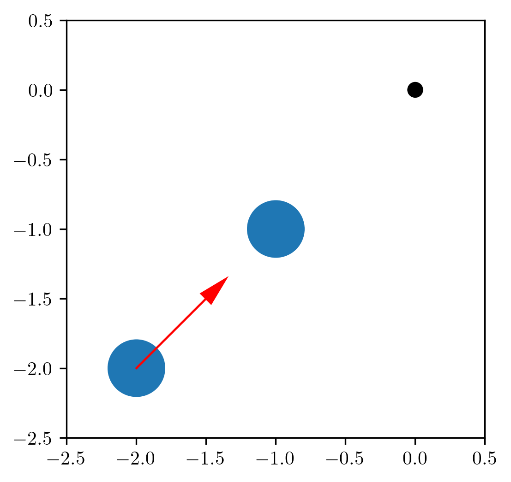
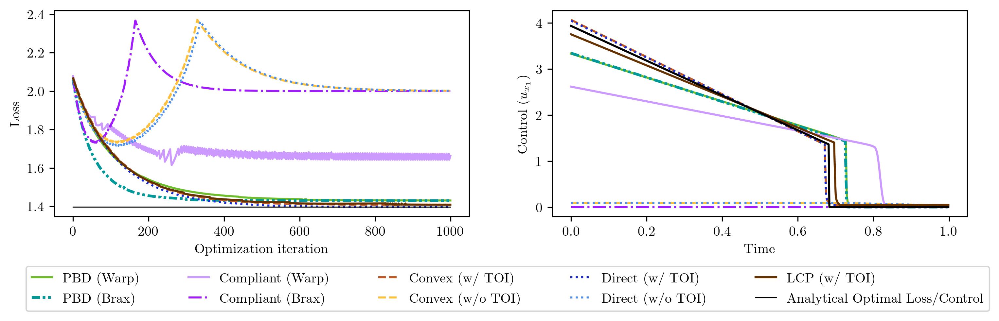

---

<div align="center">    
 
## Differentiable Physics Simulations with Contacts: Do They Have Correct Gradients w.r.t. Position, Velocity and Control?

Yaofeng Desmond Zhong, Jiequn Han, Georgia Olympia Brikis | 2022 

[](https://openreview.net/forum?id=KIl0LZ9tJex)
[](https://arxiv.org/abs/2207.05060)


</div>

This repository contains scripts to reproduce results in our [paper](https://arxiv.org/abs/2207.05060). 

## Reproducibility

All experiments __do not__ require GPUs.

To install all dependencies:
```bash
pip install -r requirements.txt
# or to install the exact versions of packages as done in this work. 
pip install -r requirements_freeze.txt
```

Please check out the README files in the task folders for how to reproduce the results shown in the paper. 

## Overview

In this work, we compare the gradients calculated by different differentiable contact models as shown in the following table. 

| Differentiable contact models | Implementations |
| ----------------------------- | --------------- |
| Linear complementarity problems (LCPs) | [NimblePhysics](https://github.com/nimblephysics/nimblephysics) |
| Convex optimization                    | [DiffCoSim](https://github.com/Physics-aware-AI/DiffCoSim) |
| Compliant models                       | [Warp](https://github.com/NVIDIA/warp) and [Brax](https://github.com/google/brax) |
| Position-based dynamics (PBD)          | [Warp](https://github.com/NVIDIA/warp) and [Brax](https://github.com/google/brax) |
| Direct Velocity Impulse                | [DiffTaichi](https://github.com/taichi-dev/difftaichi) |


We apply these implementations to three tasks.

| Task 1. Gradients with a Simple Collision   |   Task 2. Optimize the Initial Velocity of a Bouncing Ball to Hit a Target  | Task 3.  Learning Optimal Control with a Two-ball Collision |
| :---------:|:------:|:------------------------:|
|  |  |  |

Our results show that gradients calculated by different implementation do not agree. Some implementations fail to achieve the optimization tasks. Please check out our paper for more details. 


## Task 3 Results

In this tasks, we are able to derive the analytical gradients and the analytical optimal control. Here we plot the analytical optimal loss along with the learning curves as well as the analytical optimal control and learned optimal controls. We observe that some differentiable simulators learn zero control sequences and fail to achieve the optimization task. 




## Citation
If you find this work helpful, please consider citing our paper using the following Bibtex.
```bibtex
@article{zhong2022differentiable,
  title={Differentiable Physics Simulations with Contacts: Do They Have Correct Gradients w.r.t. Position, Velocity and Control?},
  author={Zhong, Yaofeng Desmond and Han, Jiequn and Brikis, Georgia Olympia},
  journal={arXiv preprint arXiv:2207.05060},
  year={2022}
}
```